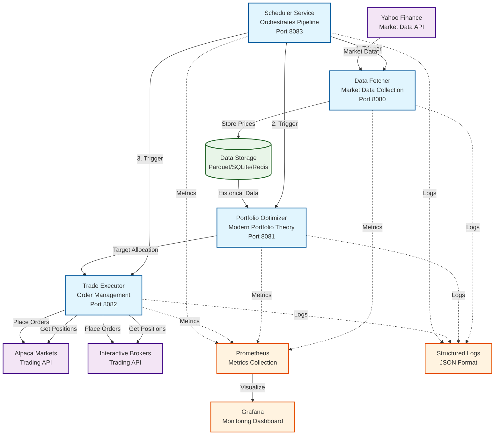

# Portfolio Rebalancer

> **Note: This project is under active development.**
>
> Initial releases may contain bugs, incomplete features, or other issues.  
> We welcome feedback and contributions as the project evolves.

An automated portfolio rebalancing system that fetches market data, optimizes allocations using Modern Portfolio Theory, and executes trades through broker APIs. Built with Python containerised with Docker and can be deployed using kubernettes.

## System Architecture

The Portfolio Rebalancer follows a microservices architecture with four core services orchestrated by a central scheduler. The **Scheduler Service** coordinates the daily execution pipeline by triggering the **Data Fetcher** to retrieve market data from Yahoo Finance, the **Portfolio Optimizer** to calculate optimal allocations using Modern Portfolio Theory, and the **Trade Executor** to rebalance positions through broker APIs. Each service operates independently with its own REST API, enabling both automated pipeline execution and manual intervention when needed.

The system integrates with external APIs including Yahoo Finance for market data and broker APIs for trade execution, while supporting multiple storage backends for data persistence. Monitoring is built-in through Prometheus metrics collection, Grafana dashboards, and JSON logging, making the system production ready with observability. The modular design allows for easy customization of data providers, optimization strategies, and broker integrations while maintaining separation of concerns across the pipeline stages.



## Features

- **Automated Data Fetching**: Daily market data retrieval with error handling and rate limiting
- **Portfolio Optimization**: Modern Portfolio Theory with Sharpe ratio maximization and age-based glide paths
- **Multi-Broker Support**: Alpaca and Interactive Brokers integration with paper trading
- **Flexible Storage**: Parquet files, SQLite, or Redis backends
- **Production Ready**: Docker Compose and Kubernetes deployment with monitoring
- **Extensible Design**: Plugin architecture for custom providers and strategies

## Quick Start

### Prerequisites

- Python 3.9+
- Docker and Docker Compose
- Broker account (which is supported in the framework or feel free to integrate new brokers and contribute!)

### Docker Deployment

```bash
# Copy and configure environment
cp /examples/config-production.env .env
# Edit .env with your own settings

# Start automated scheduler
docker-compose up -d scheduler

# Or run services manually
docker-compose --profile manual up -d data-fetcher optimizer executor

# Check service health
curl http://localhost:8083/health
```

### Kubernetes Deployment

```bash
# Copy and configure environment
cp /examples/config-kubernetes.yaml .env
# Edit yaml file with your own settings

# Quick deployment
./scripts/deploy-k8s.sh

# Manual deployment
kubectl create namespace portfolio-rebalancer
kubectl apply -f k8s/

# Update credentials
kubectl edit secret broker-credentials -n portfolio-rebalancer
```

## Configuration

### Essential Environment Variables

```bash
# Data Configuration
TICKERS=SPY,QQQ,VTI,VXUS,BND
STORAGE_TYPE=parquet
BACKFILL_DAYS=252

# Optimization
USER_AGE=35
RISK_FREE_RATE=0.02
OPTIMIZATION_METHOD=sharpe

# Broker (Alpaca Paper Trading)
BROKER_TYPE=alpaca
ALPACA_API_KEY=your_key_here
ALPACA_SECRET_KEY=your_secret_here
ALPACA_BASE_URL=https://paper-api.alpaca.markets

# Execution
REBALANCE_THRESHOLD=0.05
DRY_RUN=true  # Set to false for live trading
ORDER_TYPE=market

# Scheduling
EXECUTION_TIME=16:30
TIMEZONE=America/New_York
```

See `examples/config-development.env` and `examples/config-production.env` for complete configuration examples.

## Usage

### Manual Execution

```bash
# Fetch market data
python -m src.portfolio_rebalancer.services.fetcher_service

# Calculate optimal allocations
python -m src.portfolio_rebalancer.services.optimizer_service

# Execute trades (dry run)
python -m src.portfolio_rebalancer.services.executor_service --dry-run

# Run complete pipeline
python -m src.portfolio_rebalancer.services.scheduler_service --run-once
```

### REST API

```bash
# Trigger data fetching
curl -X POST http://localhost:8080/fetch

# Get optimization results
curl http://localhost:8081/optimize

# Execute trades
curl -X POST http://localhost:8082/execute

# Check pipeline status
curl http://localhost:8083/status
```

### Monitoring

```bash
# Check service health
curl http://localhost:8080/health

# View Prometheus metrics
curl http://localhost:8000/metrics

# Monitor logs
docker-compose logs -f scheduler
```

## Deployment Profiles

### Development

```bash
docker-compose up -d scheduler
# Uses paper trading, debug logging, dry run mode
```

### Production with Monitoring

```bash
docker-compose --profile monitoring up -d
# Includes Prometheus and Grafana
# Access: http://localhost:3000 (default login: admin/admin)
```

### Manual Services

```bash
docker-compose --profile manual up -d data-fetcher optimizer executor
# Run services individually
```

## Documentation

- **API Documentation**: [docs/API.md](docs/API.md)
- **Troubleshooting Guide**: [docs/TROUBLESHOOTING.md](docs/TROUBLESHOOTING.md)
- **Monitoring Setup**: [docs/MONITORING.md](docs/MONITORING.md)
- **Configuration Examples**: [examples/](examples/)
